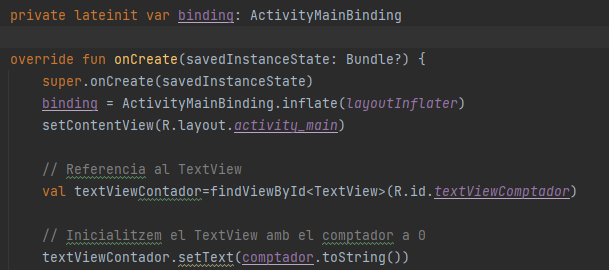

# Comptador

### 1. Anàlisi de l'estructura del projecte

Aquest projecte consisteix en una aplicació per a dispositius mòbils que consisteix en un comptador que li hem d'afegir dos botons funcionals que un disminuïsca el comptador i un altre el restablisca a 0.

En la vista de fitxers del projecte podem apreciar l’estructura de fitxers típica d’un projecte Gradle, amb fitxers generals de l’aplicació en la carpeta arrel, així com la carpeta pròpia del mòdul d’aplicació app.

Vegem alguns dels elements més importants d’aquesta organització:

* Els scripts Gradle de construcció del projecte, en format Kotlin DSL , tant el general, situat en l’arrel, amb informació comuna a tots els mòduls, com el propi del mòdul de l’aplicació . En la vista d’Android, es mostren tots dos scripts dins de Gradle Scripts, indicant si és el script corresponent al projecte o al mòdul.

* Dins de la carpeta del mòdul trobem la carpeta src, que conté els el codi font de l’aplicació . En la vista Android, aquest es troba en la carpeta java, i com veiem, es mostra en format de nom de paquet, en lloc de mostrar l’estructura de directoris.

* La carpeta app/src/res, que contindrà els recursos de l’aplicació . Si ens fixem en el detall, aquesta carpeta conté bastants subcarpetas, per als diferents tipus de recursos.

* El fitxer descriptor de l’aplicació: app/AndroidManifest.xml, amb informació associada a aquesta. Com veurem, es tracta d’un dels fitxers més importants del nostre projecte, ja que defineix aspectes com el nom de l’aplicació i el paquet, la icona, i els seus diferents components.

### 2. Anàlisi del cicle de vida i el problema de la pèrdua d'estat.

Ens trobem amb un problema de perduda d'estat, això vol dir que quan girem la pantalla del mòbil i la pantalla es recarrega perdem el comptador i torna a estar a 0, això passa perquè en recarregar l'aplicació es torna a inicialitzar, llavors cal buscar una solució perquè guarde en una variable el comptador i després el torne a mostrar.

Investigant sobre els mètodes de mode callback m'he adonat que necessite dos mètodes, el primer per a guardar el valor entre onStop() i onDestroy() que seria el mètode onSaveInstanceState(), després un altre mètode per a recuperar el valor que teníem i es posaria entre onStart() i onResume() que seria el mètode onRestoreInstanceState()

### 3. Solució a la pèrdua d'estat.

Després d'adonar-me el perquè pasa la perduda d'estat implemente els dos mètodes al codi del fitxer de *MainActivity*, però ara en girar la pantalla torna a eixir 0 i quan li dones al mes torna a pujar al numero que ténia abans i això és perquè falta mostrar-ho en la pantalla, per a solucionar-ho he posat aquesta línea de codi en el mètode onRestoreInstanceState() ->
**textViewContador.setText(comptador.toString())**

### 4. Ampliant la funcionalitat amb decrements i resets.

Primer cal crear dos botons nous, un per a disminuir el comptador i un altre per a restablir-lo a 0 en el fitxer *activity_main* en la carpeta de *layout*.

Quedarien així:

Una vegada tenim els botons hem d'implementar-los en el fitxer del *MainActivity*.

Per ultim relacionem un funcionament al botó perquè quan es prema faça el que se li indique, jo he afegit una condició perquè no puga baixar del 0 el comptador.

### 5. Aplica el view bilding

##### 1. Activar el ViewBinding a les buildFeatures de l’script Gradle del mòdul.

##### 2. Sincronitzar el projecte amb aquest script, per a que genere les classes de vinculació.

##### 3. Importar la classe de vinculació en el fitxer de la classe on l’anem a utilitzar.

##### 4. Declarar l’objecte (binding) que accedirà a aquesta classe (generalment com a lateinit) i definir-lo mitjançant l’unflat de la vista.

